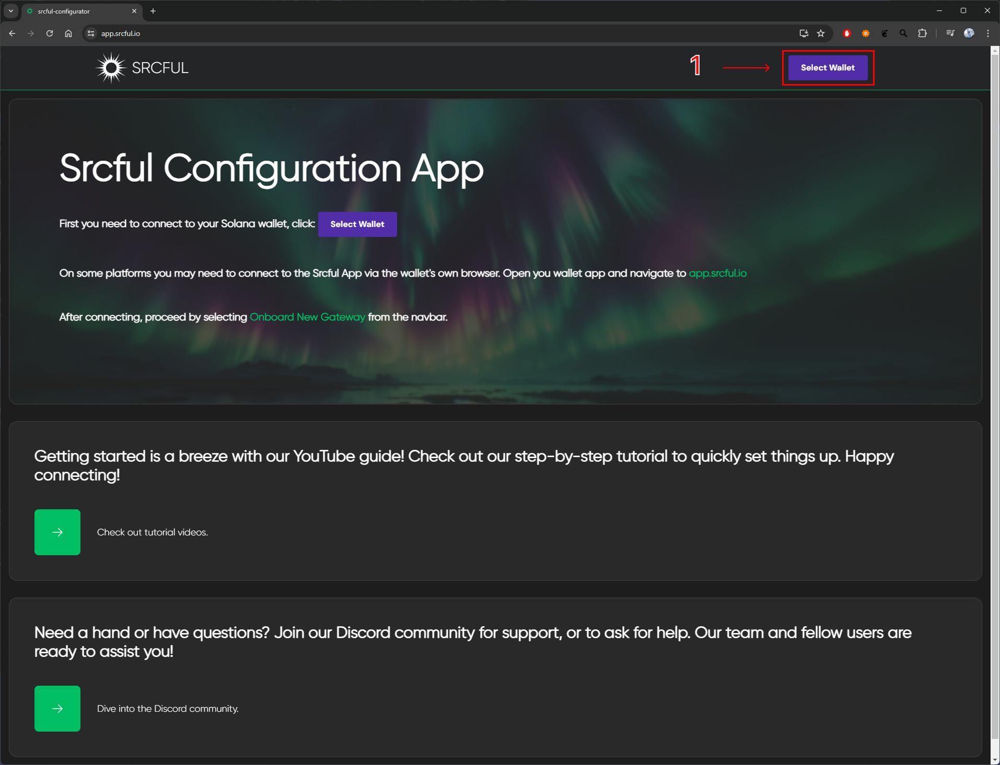
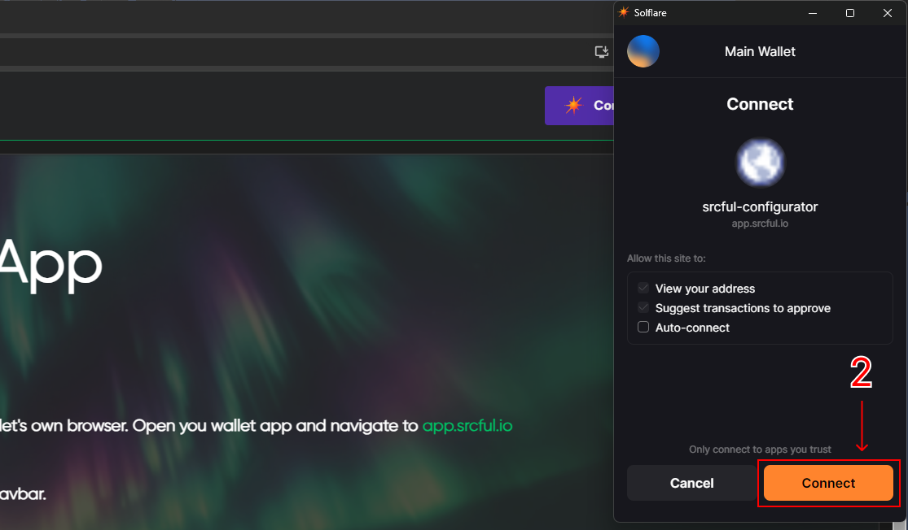
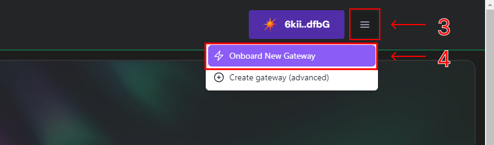
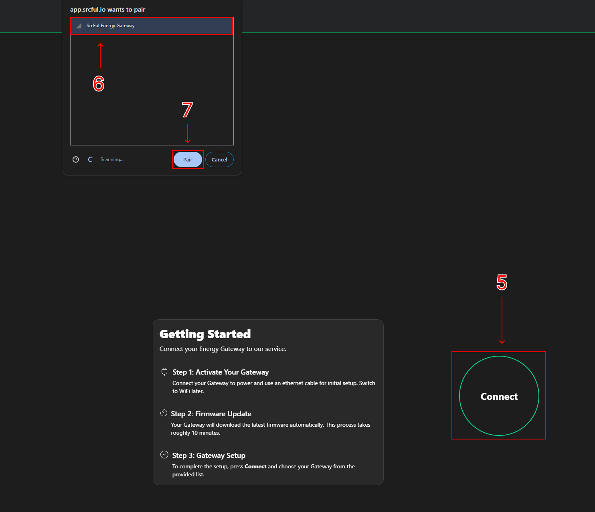
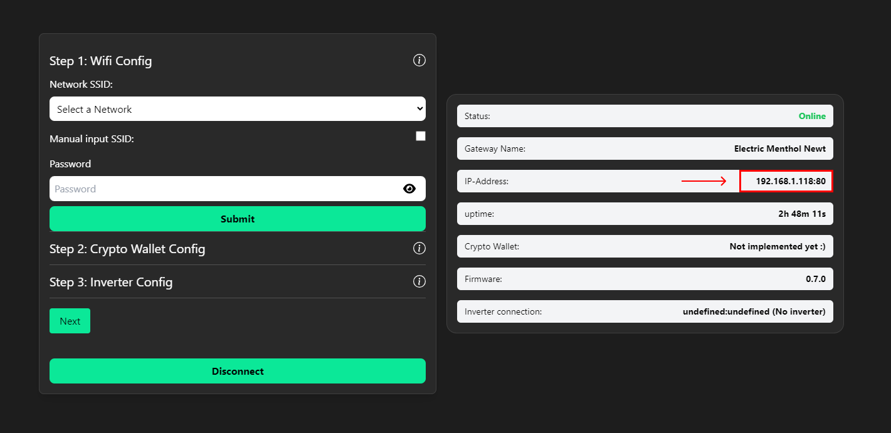
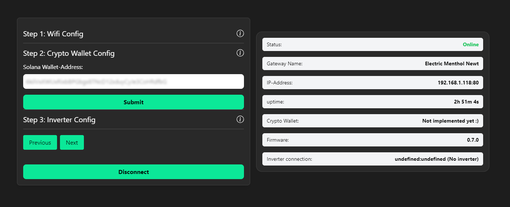
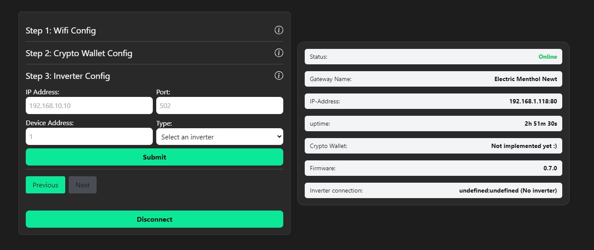
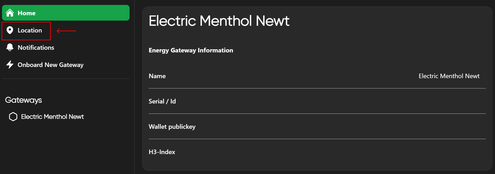
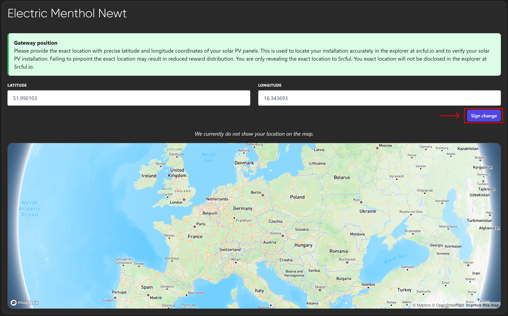

# Energy Gateway: Getting Started

---
**Important**

- You will need a compatible inverter to connect your Energy Gateway. Please see our list of compatible inverters: https://docs.srcful.io/energy-gateway/compatible-inverter/

---

This is a step-by-step guide on how to get started with your Energy Gateway using Bluetooth.

If you have a DIY Energy Gateway or RAK Helium Miner V2, follow [**this guide**](https://github.com/srcfl/egw-diy/blob/main/rak-hotspot-helium-iot-src-dual-mining.md) before proceeding with this guide.

## Step 1 - Starting and pairing

Connect the Energy Gateway to the internet using an Ethernet cable, and power it on by connecting the power cable.

Wait **approximately 10-15 minutes** for the Energy Gateway to start up and fetch the latest firmware. 

### Wi-Fi

If you wish to use Wi-Fi instead of Ethernet, you can remove the Ethernet cable at this point.

### Pairing over Bluetooth

---
**Important!**

- iPhones **cannot** be used for this process as of right now.

- You must have a **Solana Wallet** and a browser plugin (PC/Mac/Linux) like **Phantom** or **Solflare** or an app like Phantom or Solflare (Android) to be able to link your Wallet.

- Should you lose connection to your Energy Gateway during this process, you must refresh your browser window, and sometimes restart your Bluetooth. 

- If you experience issues with several failed attempts or dropped connection, disconnect any other bluetooth devices that are paired to your computer or Android phone, then try again.

---

Now you are ready to visit https://app.srcful.io to start pairing your Energy Gateway.

* Start by clicking the "Select Wallet"-button to link your Solana Wallet:

* Connect your Solana Wallet: 

* Start the pairing process by clicking the hamburger menu and selecting "Onboard New Gateway":

* Finish the pairing process by selecting your Energy Gateway in the Bluetooth menu that pops up in your browser:

**You have now successfully paired your Energy Gateway, and are now ready to move on to the next section - configuration!**

## Step 2 - Configuration

---
**Important!**

- To find your inverter's IP address, please refer to your router admin page.

- For other information regarding your inverter, please refer to the inverter documentation.

---

In this section, we will configure Wi-Fi (optional) and connect the Energy Gateway to an inverter.

* Start by selecting your Wi-Fi network in the dropdown menu, and enter your password, and click Submit. You will see it's IP Address when it has successfully connected:

* Enter your Solana Wallet-Address, and click Submit: 

* Enter your Inverter information and click Submit:

**You have now successfully paired your Energy Gateway to your inverter!**

## Step 3 - Location

* Go to the location tab in the side menu.

* Set your location by entering your coordinates or click on the map, then press **Sign change**.

