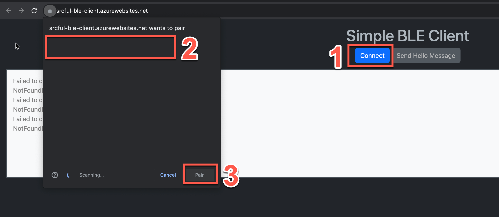

# egw-getting-started

This is a step-by-step guide on how to get started with your energy gateway. 

## Step 1 - Bluetooth pairing

Power on the gateway and wait ~2 minutes for the system to start up. The visit https://srcful-ble-client.azurewebsites.net/ to get started with the gateway configuration. 

Once your device is paired with the gateway, you should see an output in the white terminal section indicating that. The `internet connection` status under [Step 2](#step-2) should also say `Connected` or `Not connected`. 

Note: If the `internet connection` is `Unknown`, then there might be a bluetooth pairing issue. In that case, ty the pairing process again. Changing the browser might sometimes help. IPhone will not work for this, but MAC will (and pc + android).

More info on this soon...

## Step 2 - Network configuration
This is a straight forward step. If you with to connect your enery gateway over ethernet, please skip this step. 

Note: The `internet connection` should say `Connected` when connected over ethernet. 

## Step 3 - Solana wallet setup
To receive `SRC-tokens`, you need to enter your solana wallet ID. It is possible to skip this step for now, but we will require this information in the future. 

## Step 4 - Inverter configuration
Finally, enter the neccessary inverter details. The Gateway needs an `IP-address`, `port`, `modbus device address` and the `type` of the inverter. 

We will, in the near future, have an option to scan the local network for inverters. But for now, users need to know the IP-address of their inverter.

Note: Currently, there is no way of knowing if the gateway is successfully reading and sending inverter data.. To confirm, please reach out to @david or @tobias. The device name is needed, so keep the post-it around. 