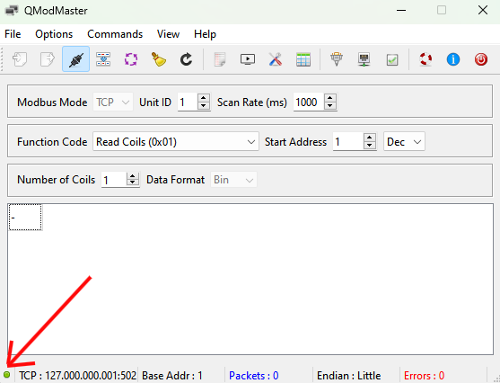

# Testing Connection to Solar Inverter Using Modbus TCP

This simplified guide should help you quickly test the Modbus TCP connection to your solar inverter using QModMaster.

Just a heads up, enabling Modbus TCP/IP on your solar inverter is key for using it with network tools. But remember, the steps to turn it on can vary based on the inverter model you have. Usually, this is done in the inverter APP.

## Install QModMaster

- **Download and Install:** Obtain QModMaster from [sourceforge](https://sourceforge.net/projects/qmodmaster/). There are similar softwares for MAC and Linux.

## Connect to Network

- Ensure both your **computer** and the **solar inverter** are connected to the same network.

## Open QModMaster

- Launch QModMaster on your computer.

## Configure Connection

Navigate to `Options` -> `Modbus TCP`

> **Important note about Modbus**
>
> While **502** is the default port, other common ports for Modbus TCP are: **1502** (SolarEdge and others), **6607** (Huawei), **8899** (Deye and others). Be sure to test for multiple ports.
>
> This also applies to **Unit ID**, which can be set manually, often in the app or web interface where you can configure your inverter. If you have not set Unit ID yourself, try either Unit ID **1** or **0**.

- **Slave IP:** Enter the solar inverter's IP address.
- **TCP Port:** Use `502` (default for Modbus TCP).

Now press `OK`.

- **Modbus Mode:** Choose `TCP`.
- **Unit ID:** Input the inverter's Modbus slave ID (commonly `1`).

Leave the rest of the fields as is, and let's check if we can connect to the inverter.

## Connect

- Click the **"Connect"** button to start the connection.

The status indicator at the bottom of the window should turn green if the connection is successful. If it remains red, then there is a connection issue and we recommend double-checking that Modbus TCP/IP is enabled on the inverter and that the IP address and port are correct.